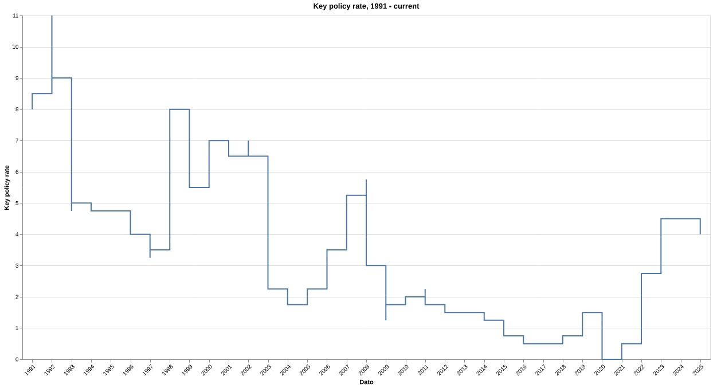
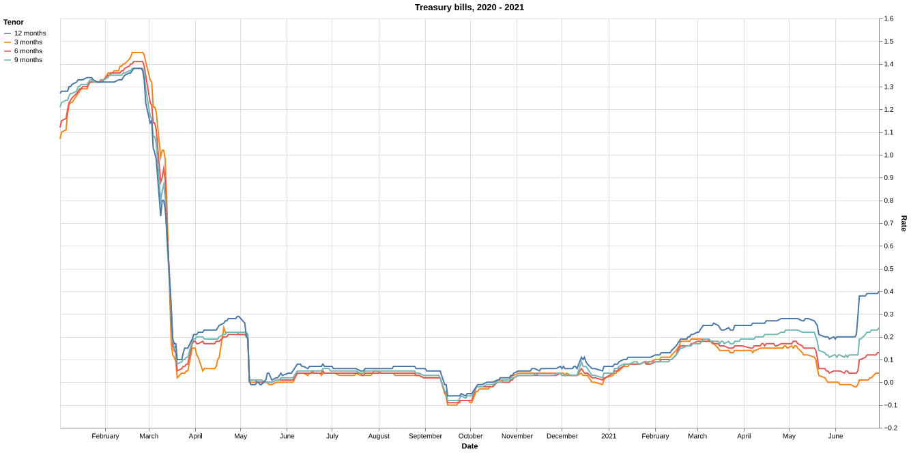
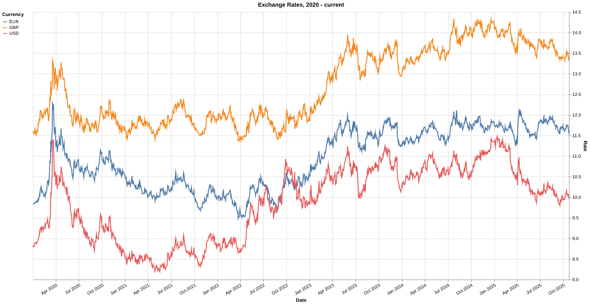

# Norway - Finance Statistics
[](https://github.com/frefrik/norway-finance-statistics/actions?query=workflow%3A%22Scheduled+data+update%22+event%3Aschedule+branch%3Amaster)
## Description
A collection of Norwegian financial data.  
The datasets in this repository are automaticly updated every day at **2:05 AM** and **2:05 PM** (CEST).

## Overview

<!-- table starts -->
|Dataset|Data Source|Date Range|Updated|Download|Preview|
| :--- | :--- | :--- | :--- | :--- | :--- |
|[NIBOR](#nibor)|Norges Bank<br>Norske Finansielle Referanser AS|1986 - 2013<br>2020 - Present|2020-10-11|[<center>csv</center>](https://raw.githubusercontent.com/frefrik/norway-finance-statistics/master/data/no_nibor.csv)|[<center>preview</center>](data/no_nibor.csv)|
|[NIBOR w/panel banks](#nibor-wpanel-banks)|Norske Finansielle Referanser AS|2020 - Present|2020-10-11|[<center>csv</center>](https://raw.githubusercontent.com/frefrik/norway-finance-statistics/master/data/no_nibor_panel.csv)|[<center>preview</center>](data/no_nibor_panel.csv)|
|[Key policy rate](#key-policy-rate)|Norges Bank|1991 - Present|2020-10-09|[<center>csv</center>](https://raw.githubusercontent.com/frefrik/norway-finance-statistics/master/data/no_keyPolicyRate.csv)|[<center>preview</center>](data/no_keyPolicyRate.csv)|
|[NOWA](#nowa---norwegian-overnight-weighted-average)|Norges Bank|2011 - Present|2020-10-09|[<center>csv</center>](https://raw.githubusercontent.com/frefrik/norway-finance-statistics/master/data/no_nowa.csv)|[<center>preview</center>](data/no_nowa.csv)|
|[Treasury bills](#treasury-bills)|Norges Bank|2003 - Present|2020-10-09|[<center>csv</center>](https://raw.githubusercontent.com/frefrik/norway-finance-statistics/master/data/no_treasuryBills.csv)|[<center>preview</center>](data/no_treasuryBills.csv)|
|[Government bonds](#government-bonds)|Norges Bank|1986 - Present|2020-10-09|[<center>csv</center>](https://raw.githubusercontent.com/frefrik/norway-finance-statistics/master/data/no_governmentBonds.csv)|[<center>preview</center>](data/no_governmentBonds.csv)|
|[Exchange Rates](#exchange-rates)|Norges Bank|1980 - Present|2020-10-10|[<center>csv</center>](https://raw.githubusercontent.com/frefrik/norway-finance-statistics/master/data/no_exchangeRates.csv)|[<center>preview</center>](data/no_exchangeRates.csv)|
<!-- table ends -->

## Datasets
### NIBOR
Nibor (Norwegian Inter Bank Offered Rate) is a collective term for Norwegian money market rates at different maturities. Nibor is intended to reflect the interest rate level a bank require for unsecured money market lending in NOK to another bank.

##### Dataset format:
```
Date,1 Week,1 Month,2 Months,3 Months,6 Months
1986-01-02,12.67841,12.6194,,12.80975,12.93966
1986-01-03,12.59994,12.52899,,12.83989,12.92999
...
```  


---
### NIBOR w/panel banks
Nibor (Norwegian Inter Bank Offered Rate) is a collective term for Norwegian money market rates at different maturities. Nibor is intended to reflect the interest rate level a bank require for unsecured money market lending in NOK to another bank.  

- **DNBB**: DNB Bank ASA  
- **DSKE**: Danske Bank A/S  
- **HAND**: Svenska Handelsbanken AB  
- **NORD**: Nordea Bank ABP  
- **SEBB**: SEB AB  
- **SWED**: Swedbank AB

##### Dataset format:
```
Date,Calculation Date,Tenor,Fixing Rate,DNBB,DSKE,HAND,NORD,SEBB,SWED
2020-01-02,2 Jan 2020,1 Week,1.57,1.55,1.53,1.67,1.57,1.58,1.57
2020-01-02,2 Jan 2020,1 Month,1.65,1.71,1.66,1.64,1.67,1.64,1.56
...
```


---
### Key policy rate
The policy rate in Norway is the interest rate on banks' overnight deposits in Norges Bank up to a specified quota.

The policy rate and policy rate expectations primarily influence interbank rates and banks' interest rates on customer deposits and loans. Market rates, in turn, affect the krone exchange rate, securities prices, house prices, credit demand, consumption and investment.

##### Dataset format:
```
Date,Rate
1991-01-01,8.5
1991-01-02,8.5
...
```


---
### Nowa - Norwegian Overnight Weighted Average
Nowa is the interest rate on unsecured overnight interbank loans between banks that are active in the Norwegian overnight market. Nowa is based on actual transactions reported on Norges Bank's RPD (money market data reporting) form.

##### Dataset format:
```
Date,Rate,Volume,Qualifier,Banks lending,Banks borrowing,Transactions
2011-09-30,2.69,4659,Traded,0,0,0
2011-10-03,2.29,0,Estimated,0,0,0
...
```
---
### Treasury bills
Treasury bills are government securities, with an original maturity of less than one year.

##### Dataset format:
```
Date,3 months,6 months,9 months,12 months
2003-01-08,6.09,5.75,5.61,5.49
2003-01-09,6.07,5.74,5.59,5.49
...
```


---
### Government bonds
A bond is an interest-bearing security with an original maturity of more than 1 year.

##### Dataset format:
```
Date,3 years,5 years,10 years
1986-01-03,,13.63,13.49
1986-01-10,,13.64,13.48
...
```


---
### Exchange Rates
Norges Bank's exchange rates are middle rates, i.e. the mid-point between buying and selling rates in the interbank market at a given time.

##### Dataset format:
```
Date,Quote Currency,AUD,BDT,BGN,BRL,BYN,CAD,CHF,CNY,CZK,DKK,EUR,GBP,HKD,HRK,HUF,I44,IDR,ILS,INR,ISK,JPY,KRW,MMK,MXN,MYR,NZD,PHP,PKR,PLN,RON,RUB,SEK,SGD,THB,TRY,TWD,TWI,USD,XDR,ZAR
2020-06-02,NOK,6.547999999999999,11.26,546.06,1.795,3.986,7.0699,994.3,134.48,40.082,143.27,10.6798,11.9886,1.2331,140.81,3.0896,114.95,0.066304,2.748,12.708,7.07,8.8387,0.7827,0.6842,43.69,2.2344,6.0406,19.047,5.78,2.4276,220.55,13.905999999999999,102.18,6.8163,30.279,141.08,31.941999999999997,126.0,9.5577,13.225929999999998,0.5541
2020-06-03,NOK,6.5588,11.24,545.95,1.8412,3.9783,7.0373,989.32,134.14,40.051,143.23,10.6777,11.9887,1.2308,141.02,3.0869999999999997,114.87,0.067217,2.7542,12.636,7.07,8.7853,0.7828,0.6818,43.98,2.2384,6.0904,19.094,5.778,2.4193,220.65,13.866,102.09,6.8202,30.215,141.05,31.87,125.93,9.5388,13.206010000000001,0.5595
...
```


---