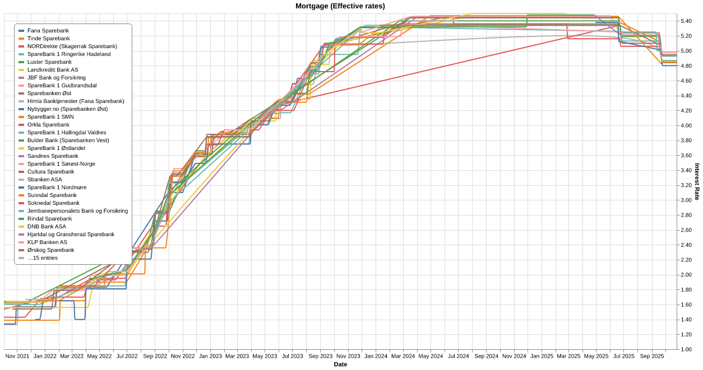
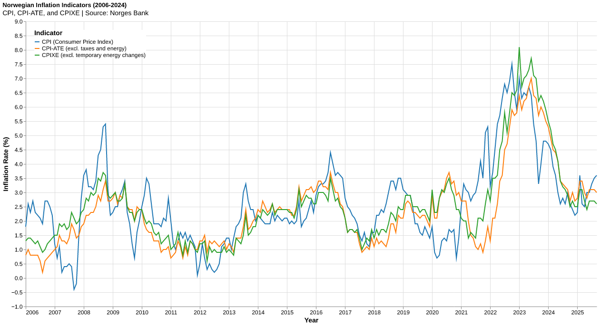
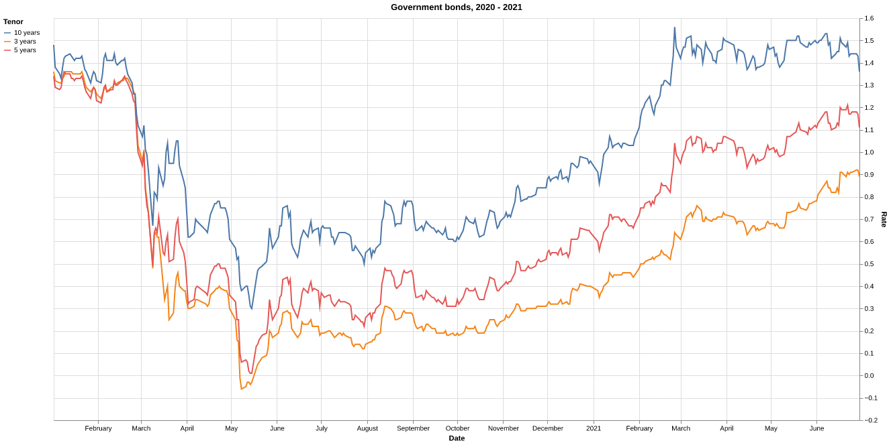
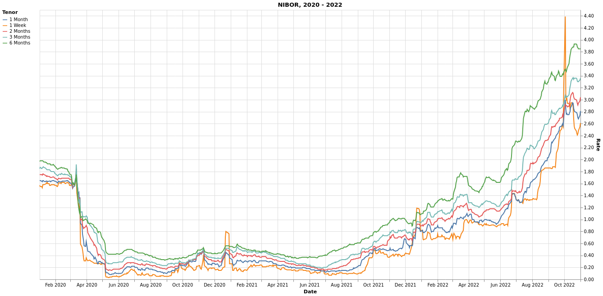
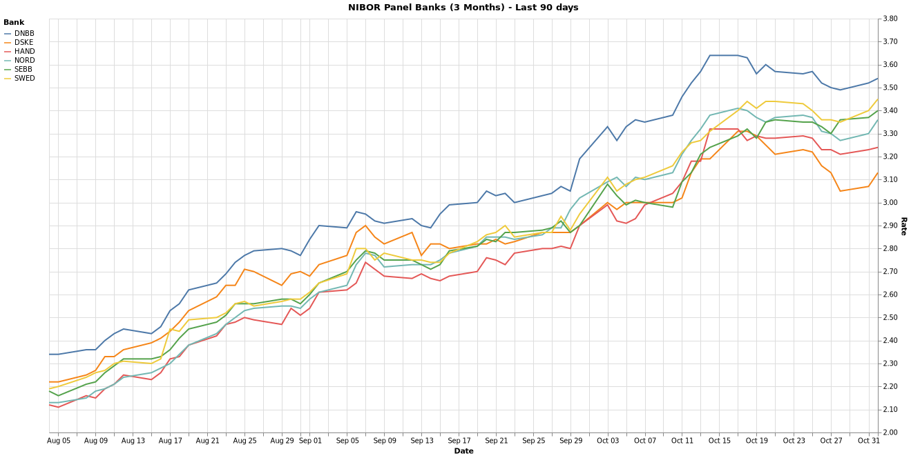

# Norway - Finance Statistics

[](https://github.com/frefrik/norway-finance-statistics/actions?query=workflow%3A%22Scheduled+data+update%22+event%3Aschedule+branch%3Amaster)

## Description

A collection of Norwegian financial data.  
The datasets in this repository are automaticly updated every day at **2:05 AM** and **2:05 PM** (CEST).

## Overview

<!-- table starts -->
|Dataset|Source|Date Range|Updated|Download|Preview|
| :--- | :--- | :--- | :--- | :--- | :--- |
|[Mortgage](#mortgage)|Finansportalen|2021 - Present|2026-01-31|[<center>csv</center>](https://raw.githubusercontent.com/frefrik/norway-finance-statistics/master/data/no_mortgage.csv)|[<center>preview</center>](data/no_mortgage.csv)|
|[Key policy rate](#key-policy-rate)|Norges Bank|1991 - Present|2026-01-30|[<center>csv</center>](https://raw.githubusercontent.com/frefrik/norway-finance-statistics/master/data/no_keyPolicyRate.csv)|[<center>preview</center>](data/no_keyPolicyRate.csv)|
|[NOWA](#nowa---norwegian-overnight-weighted-average)|Norges Bank|2011 - Present|2026-01-31|[<center>csv</center>](https://raw.githubusercontent.com/frefrik/norway-finance-statistics/master/data/no_nowa.csv)|[<center>preview</center>](data/no_nowa.csv)|
|[Exchange Rates](#exchange-rates)|Norges Bank|1980 - Present|2026-01-31|[<center>csv</center>](https://raw.githubusercontent.com/frefrik/norway-finance-statistics/master/data/no_exchangeRates.csv)|[<center>preview</center>](data/no_exchangeRates.csv)|
|[Inflation Indicators (CPI)](#inflation-indicators-cpi)|Norges Bank|2006 - Present|2026-01-10|[<center>csv</center>](https://raw.githubusercontent.com/frefrik/norway-finance-statistics/master/data/no_cpi.csv)|[<center>preview</center>](data/no_cpi.csv)|
<!-- table ends -->

### Discontinued
> |Dataset|Source|Date Range|Updated|Download|Preview|
> | :--- | :--- | :--- | :--- | :--- | :--- |
> |[Treasury bills](#treasury-bills)|Norges Bank|2003 - 2021|2021-07-01|[<center>csv</center>](https://raw.githubusercontent.com/frefrik/norway-finance-statistics/master/data/no_treasuryBills.csv)|[<center>preview</center>](data/no_treasuryBills.csv)|
> |[Government bonds](#government-bonds)|Norges Bank|1986 - 2021|2021-07-01|[<center>csv</center>](https://raw.githubusercontent.com/frefrik/norway-finance-statistics/master/data/no_governmentBonds.csv)|[<center>preview</center>](data/no_governmentBonds.csv)|
> |[NIBOR](#nibor)|Norges Bank<br>Norske Finansielle Referanser AS|1986 - 2013<br>2020 - 2022|2022-11-02|[<center>csv</center>](https://raw.githubusercontent.com/frefrik/norway-finance-statistics/master/data/no_nibor.csv)|[<center>preview</center>](data/no_nibor.csv)|
> |[NIBOR w/panel banks](#nibor-wpanel-banks)|Norske Finansielle Referanser AS|2020 - 2022|2022-11-02|[<center>csv</center>](https://raw.githubusercontent.com/frefrik/norway-finance-statistics/master/data/no_nibor_panel.csv)|[<center>preview</center>](data/no_nibor_panel.csv)|


## Datasets

### Mortgage

Finansportalen.no is a service from the Norwegian Consumer Council, and will give consumers power and the opportunity to make good choices in the market for financial services.

This dataset shows top 10 mortgages with floating interest rates, sorted ascending by effective interest rate.

The following query parameters is used to produduce the dataset:

- **Loan amount**: 5 MNOK
- **Housing value**: 7.2 MNOK
- **Repayment period**: 20 years
- **Age of borrower**: 36
- **Interest rate type**: Floating interest rate
- **Market area**: National
- **Membership needed**: False

The mortgage calculator is available here: https://finansportalen.no/bank/boliglan/

#### Source
  - Data provided by [Finansportalen.no](https://finansportalen.no)

    <a href="https://finansportalen.no">
    
    </a>

#### Dataset format

```csv
date,bank,product_name,rate_effective,rate_nominal,monthly,total_cost,first_year_cost,establishment_fee
2021-10-03,Himla Banktjenester (Fana Sparebank),Boliglån innenfor 75 %,1.33,1.32,23716,5691840,284592,0
2021-10-03,Nybygger.no (Sparebanken Øst),Boliglån 75%,1.34,1.33,23738,5697120,284856,0
2021-10-03,SpareBank 1 SMN,Grønt førstehjemslån,1.39,1.35,23852,5724480,286224,2650
2021-10-03,NORDirekte (Skagerrak Sparebank),Boliglån inntil 70 %,1.43,1.4,23938,5745120,287256,0
2021-10-03,Orkla Sparebank,Grønt boliglån,1.54,1.5,24192,5806080,290304,2000
...
```  



---

### Key policy rate

The policy rate in Norway is the interest rate on banks' overnight deposits in Norges Bank up to a specified quota.

The policy rate and policy rate expectations primarily influence interbank rates and banks' interest rates on customer deposits and loans. Market rates, in turn, affect the krone exchange rate, securities prices, house prices, credit demand, consumption and investment.

#### Source

- [Norges Bank](https://norges-bank.no/en/)

#### Dataset format

```csv
Date,Rate
1991-01-01,8.5
1991-01-02,8.5
...
```


---

### Nowa - Norwegian Overnight Weighted Average

Nowa is the interest rate on unsecured overnight interbank loans between banks that are active in the Norwegian overnight market. Nowa is based on actual transactions reported on Norges Bank's RPD (money market data reporting) form.

#### Source

- [Norges Bank](https://norges-bank.no/en/)

#### Dataset format

```csv
Date,Rate,Volume,Qualifier,Banks lending,Banks borrowing,Transactions
2011-09-30,2.69,4659,Traded,0,0,0
2011-10-03,2.29,0,Estimated,0,0,0
...
```

---

### Exchange Rates

Norges Bank's exchange rates are middle rates, i.e. the mid-point between buying and selling rates in the interbank market at a given time.

#### Source

- [Norges Bank](https://norges-bank.no/en/)

#### Dataset format

```csv
Date,Quote Currency,AUD,BDT,BGN,BRL,BYN,CAD,CHF,CNY,CZK,DKK,EUR,GBP,HKD,HRK,HUF,I44,IDR,ILS,INR,ISK,JPY,KRW,MMK,MXN,MYR,NZD,PHP,PKR,PLN,RON,RUB,SEK,SGD,THB,TRY,TWD,TWI,USD,XDR,ZAR
2020-06-02,NOK,6.547999999999999,11.26,546.06,1.795,3.986,7.0699,994.3,134.48,40.082,143.27,10.6798,11.9886,1.2331,140.81,3.0896,114.95,0.066304,2.748,12.708,7.07,8.8387,0.7827,0.6842,43.69,2.2344,6.0406,19.047,5.78,2.4276,220.55,13.905999999999999,102.18,6.8163,30.279,141.08,31.941999999999997,126.0,9.5577,13.225929999999998,0.5541
2020-06-03,NOK,6.5588,11.24,545.95,1.8412,3.9783,7.0373,989.32,134.14,40.051,143.23,10.6777,11.9887,1.2308,141.02,3.0869999999999997,114.87,0.067217,2.7542,12.636,7.07,8.7853,0.7828,0.6818,43.98,2.2384,6.0904,19.094,5.778,2.4193,220.65,13.866,102.09,6.8202,30.215,141.05,31.87,125.93,9.5388,13.206010000000001,0.5595
...
```


---

### Inflation Indicators (CPI)

The inflation indicators dataset provides various Consumer Price Index (CPI) measures for Norway. This includes the headline `CPI`, `CPI-ATE` (CPI adjusted for tax changes and excluding energy products), `CPIXE` (CPI adjusted for tax changes and excluding temporary changes in energy prices), and other inflation measures.

The dataset includes the following columns:
- `month`: The year and month of the observation
- `cpi`: Consumer Price Index (CPI)
- `cpi_ate`: CPI adjusted for tax changes and excluding energy products
- `cpixe`: CPI adjusted for tax changes and excluding temporary changes in energy prices
- `trimmed_mean`: A trimmed mean of the 12-month change in the sub-indices in the CPI adjusted for tax changes (CPI-AT)
- `weighted_median`: A weighted median of the 12-month change in the sub-indices in the CPI-AT.

#### Source

- [Norges Bank](https://norges-bank.no/en/)

#### Dataset format
```csv
month,cpi,cpi_ate,cpixe,trimmed_mean,weighted_median
2006-01,1.8,0.8,1.3,1.6,1.7
2006-02,2.6,1.0,1.4,1.7,1.8
...
```



<details>
<summary>Discontinued datasets</summary>

### Treasury bills

> ⚠️ The last update of the synthetic yield series for both Treasury bills and government bonds was on 30 June 2021.  
> Source: https://www.norges-bank.no/en/topics/Statistics/zero-coupon-yields/Treasury-bills-daily/

Treasury bills are government securities, with an original maturity of less than one year.

#### Source

- [Norges Bank](https://norges-bank.no/en/)

#### Dataset format

```csv
Date,3 months,6 months,9 months,12 months
2003-01-08,6.09,5.75,5.61,5.49
2003-01-09,6.07,5.74,5.59,5.49
...
```


---

### Government bonds

> ⚠️ The last update of the synthetic yield series for both Treasury bills and government bonds was on 30 June 2021.  
> Source: https://www.norges-bank.no/en/topics/Statistics/zero-coupon-yields/Government-bonds-daily/

A bond is an interest-bearing security with an original maturity of more than 1 year.

#### Source

- [Norges Bank](https://norges-bank.no/en/)

#### Dataset format

```csv
Date,3 years,5 years,10 years
1986-01-03,,13.63,13.49
1986-01-10,,13.64,13.48
...
```



---

### NIBOR

> ⚠️ NIBOR has launched a new website and restricted the access to delayed Nibor rates and monthly statistics.
> [[Source](https://nore-benchmarks.com/wp-content/uploads/2022/10/2022-10-13-NoRe-launches-new-website-on-17-Oct-2022.pdf)]  
> Last dataset update: 2022-11-02

Nibor (Norwegian Inter Bank Offered Rate) is a collective term for Norwegian money market rates at different maturities. Nibor is intended to reflect the interest rate level a bank require for unsecured money market lending in NOK to another bank.

#### Source

- [Norges Bank](https://norges-bank.no/en/)
- [Norske Finansielle Referanser AS](https://referanserenter.no)

#### Dataset format

```csv
Date,1 Week,1 Month,2 Months,3 Months,6 Months
1986-01-02,12.67841,12.6194,,12.80975,12.93966
1986-01-03,12.59994,12.52899,,12.83989,12.92999
...
```  



---

### NIBOR w/panel banks

> ⚠️ NIBOR has launched a new website and restricted the access to delayed Nibor rates and monthly statistics.
> [[Source](https://nore-benchmarks.com/wp-content/uploads/2022/10/2022-10-13-NoRe-launches-new-website-on-17-Oct-2022.pdf)]  
> Last dataset update: 2022-11-02

Nibor (Norwegian Inter Bank Offered Rate) is a collective term for Norwegian money market rates at different maturities. Nibor is intended to reflect the interest rate level a bank require for unsecured money market lending in NOK to another bank.  

- **DNBB**: DNB Bank ASA  
- **DSKE**: Danske Bank A/S  
- **HAND**: Svenska Handelsbanken AB  
- **NORD**: Nordea Bank ABP  
- **SEBB**: SEB AB  
- **SWED**: Swedbank AB

#### Source

- [Norske Finansielle Referanser AS](https://referanserenter.no)

#### Dataset format

```csv
Date,Calculation Date,Tenor,Fixing Rate,DNBB,DSKE,HAND,NORD,SEBB,SWED
2020-01-02,2 Jan 2020,1 Week,1.57,1.55,1.53,1.67,1.57,1.58,1.57
2020-01-02,2 Jan 2020,1 Month,1.65,1.71,1.66,1.64,1.67,1.64,1.56
...
```



</details>
